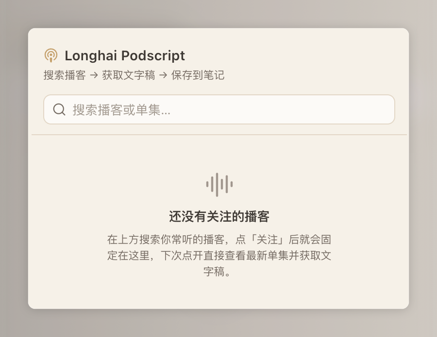
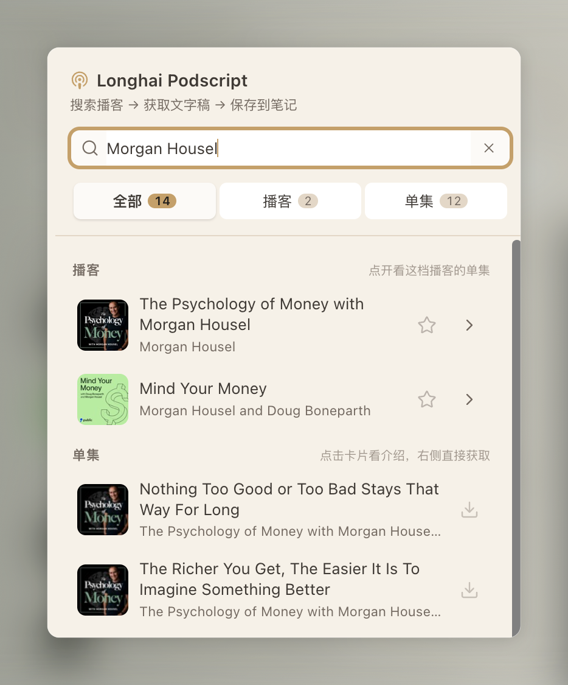
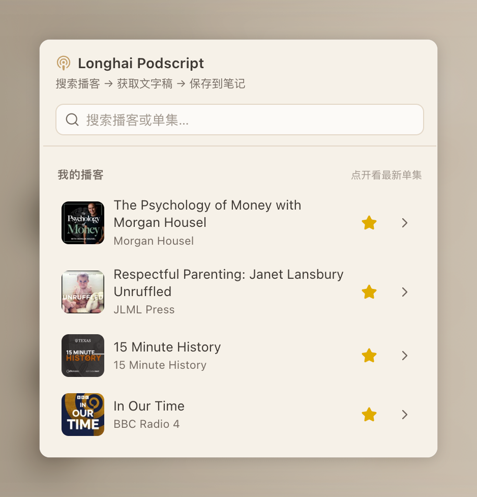
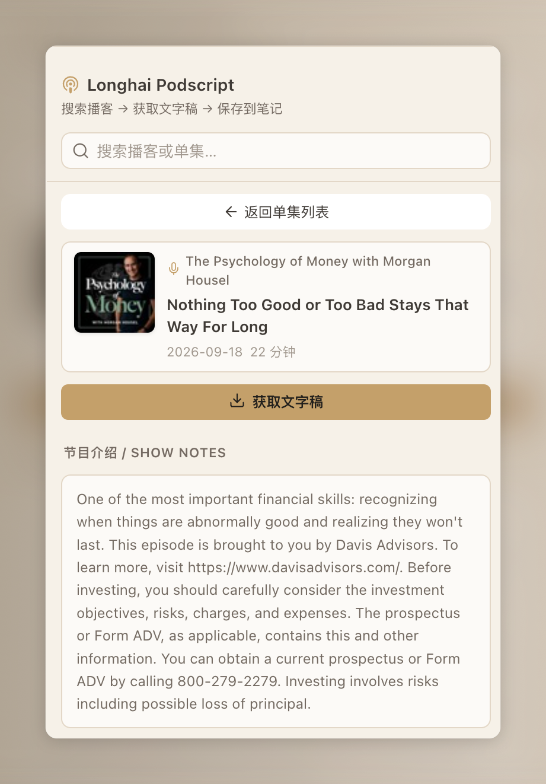
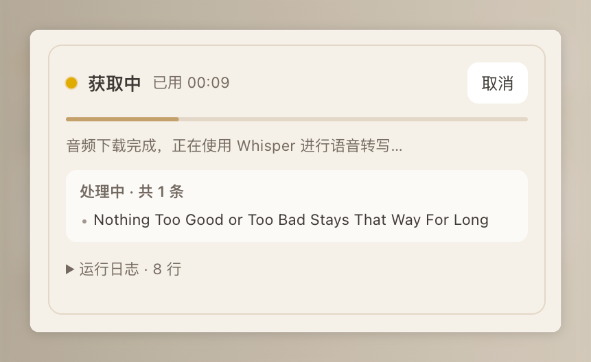
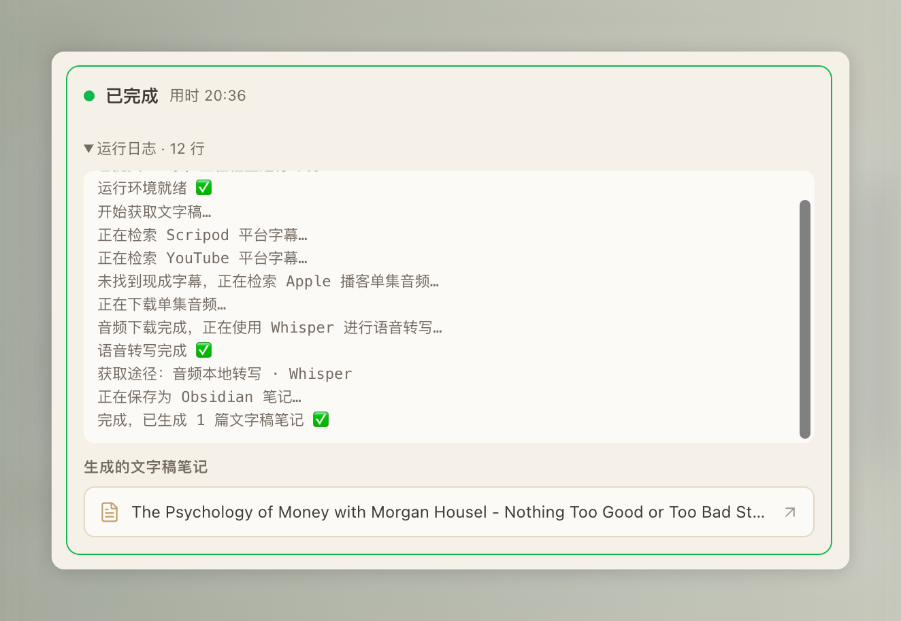

# Longhai Podscript

> 在 Obsidian 里搜索播客 → 一键抓文字稿 → 存成结构化笔记。

<p align="center">
  
</p>

搜到你爱听的播客，点一下就把整集的文字稿抓下来落成一篇笔记——不管这集有没有现成字幕。有字幕就用字幕（秒回），纯音频就在你电脑本地用 Whisper 转写，**全程免费，不用任何付费 API，也不用先装什么 AI 工具**。

抓完的文字稿是后续「脱水改稿、翻译、发布」的起点。

---

## 能做什么

- **来源很杂都能喂**：YouTube 链接 / 小宇宙 / Apple 播客页 / 音频直链 / 甚至只给个标题关键词。
- **有字幕用字幕，没字幕本地转写**：命中现成字幕就秒回；纯音频用本地 [`faster-whisper`](https://github.com/SYSTRAN/faster-whisper) 转写，免费、离线、不上传。
- **直接落成笔记**：正文是原始文字稿，开头的 frontmatter 记录来源、质量、日期，方便你之后检索和改稿。

## 界面预览

| 搜索播客 | 关注收藏 |
|---|---|
|  |  |
| 搜关键词，分「播客 / 单集」两栏，右侧一键抓取 | 关注常听的播客，固定在「我的播客」里 |

| 进入单集 | 抓取中 |
|---|---|
|  |  |
| 看节目介绍，点「获取文字稿」 | 实时进度 + 运行日志，可随时取消 |
| |  |
| | 完成：日志给出抓取途径，直接生成文字稿笔记 |

## 安装

> ⚠️ 仅支持桌面端（Windows / macOS / Linux）。插件要在本地调用 Python，手机端用不了。

**第 1 步：装 Python 3.9+**（你只需要装这一个，其余依赖插件会自己搞定）

- **macOS**：终端运行 `brew install python`，或去 [Python 官网](https://www.python.org/downloads/mac-osx/) 下安装包。
- **Windows**：去 [Python 官网](https://www.python.org/downloads/) 下安装包，**安装时务必勾选「Add python.exe to PATH」**；或在 Microsoft Store 搜 Python 3.11/3.12 装。
- **Linux**：`sudo apt install python3 python3-venv python3-pip`。

**第 2 步：装插件**

最省事的方式——直接把仓库 clone 进你库里的插件目录（文件夹名正好就是插件 id，Obsidian 能直接认）：

```bash
cd "<你的库>/.obsidian/plugins"
git clone https://github.com/longhaiqwe/longhai-podscript.git
```

> 把 `<你的库>` 换成你的 Obsidian 库的实际路径。`.obsidian` 是隐藏文件夹，若 `plugins` 目录不存在，先 `mkdir -p "<你的库>/.obsidian/plugins"`。

不想用命令行也行：在仓库页点 **Code → Download ZIP**，解压后把文件夹**重命名为 `longhai-podscript`**（去掉 `-main` 后缀），放进 `<你的库>/.obsidian/plugins/` 下。

装好后：打开 Obsidian →「设置 → 第三方插件」→ 关掉「安全模式」→ 刷新列表 → 启用 **Longhai Podscript**。（装完看不到就重启一下 Obsidian。）

> 想更新到新版本：进插件目录 `git pull` 后，在 Obsidian 里禁用再重新启用一次即可。

**第 3 步：首次准备环境（自动）**

第一次抓取，或在插件设置页点「安装 / 修复依赖」时，插件会自动：

- 在 `~/.longhai-podscript/venv` 建一个隔离的 Python 虚拟环境；
- 往里面装好 `yt-dlp` 和 `faster-whisper`。

这些都装在你的库外面，**不会污染系统 Python，也不会被库同步和插件更新弄乱**。国内网络慢的话，可以在设置里填 pip 镜像源（如清华源 `https://pypi.tuna.tsinghua.edu.cn/simple`）加速。

### 懒人法：让 AI 助手帮你装

如果你在用 Claude Code / Cursor 之类能跑命令的 AI 助手，把下面这段直接发给它，它会自动帮你装好：

```text
帮我在 Obsidian 里安装 Longhai Podscript 插件，仓库地址是
https://github.com/longhaiqwe/longhai-podscript 。请按以下步骤做，遇到不确定的先问我：

1. 先问我 Obsidian 库（vault）的绝对路径。
2. 在该库的 .obsidian/plugins/ 目录下 git clone 这个仓库（目录不存在就先创建）；
   如果已经存在同名文件夹，改为进去 git pull 更新。
3. 检查本机是否装了 Python 3.9+（运行 python3 --version）。没有的话告诉我怎么装，别擅自装。
4. 装完提醒我：打开 Obsidian →「设置 → 第三方插件」→ 关闭安全模式 → 启用
   Longhai Podscript；首次抓取会自动在 ~/.longhai-podscript/venv 里装 Python 依赖。
```

## 怎么用

1. 点左侧边栏的图标（或命令面板搜「获取播客文字稿」）打开面板。
2. 搜播客 → 点单集右侧的下载图标，或进单集页点「获取文字稿」。
3. 抓完在「播客文字稿」文件夹里就多了一篇笔记。

> 也可以在「粘贴链接 / 标题手动抓取」里，每行贴一个链接或标题批量抓。

## 一点提醒

- **文字稿是初稿**：人名、术语、标点可能有错（尤其走本地转写的），发布前请再用一遍强 LLM 校对。
- **首次会慢一点**：第一次装依赖要下几十 MB；第一次本地转写还要下 Whisper 模型（`small` 约 500MB / `medium` 约 1.5GB），之后就快了。

<details>
<summary>进阶：它是怎么决定「找字幕」还是「本地转写」的？</summary>

底层脚本按你喂进去的**输入类型**选路：

- **音频直链（`.mp3` 等）**：直接本地 Whisper 转写，不找字幕。
- **标题 / 网页链接**：先去 scripod / YouTube 等找现成字幕，找不到才退回本地转写。

所以在面板里点搜索结果抓取时，插件传的是**标题**而不是音频直链——这样才可能命中现成字幕、秒回。传标题偶尔会匹配错集（比如同名的「完整版」和「精选重剪版」），这时它会**自动改用该集音频直链本地转写重试一次**。抓完的运行日志里会打出这次实际走的路，比如 `本次途径：现成字幕 · scripod` 或 `本次途径：本地 whisper 转写`。

（手动粘链接抓取不带自动回退，按你给的输入类型直接选路。想要现成字幕就贴集页链接或标题，别贴 mp3 直链。）

</details>

## 开发

```bash
npm install
npm run dev     # 开发监听
npm run build   # 类型检查 + 生产构建
```

产物 `main.js`、`manifest.json`、`styles.css` 和 `scripts/` 复制到插件目录即可加载。

## 致谢与许可

本地转写后端脚本源自 [@一龙小包子](https://x.com/KingJing001) 的开源项目 [KingJing1/podcast-transcript-txt-skill](https://github.com/KingJing1/podcast-transcript-txt-skill)（MIT 许可，见 [`scripts/LICENSE-upstream`](scripts/LICENSE-upstream)）。

本项目以 [MIT](LICENSE) 许可开源。
